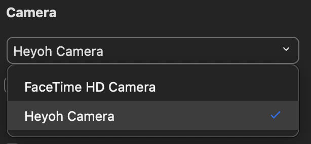
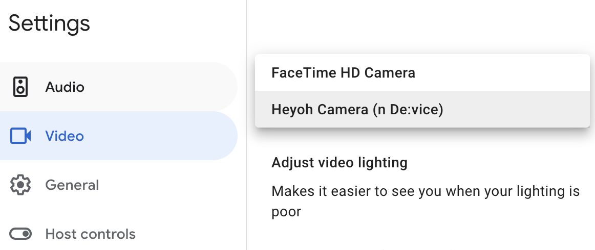

# Heyoh virtual camera

Heyoh is an open source virtual camera based on PyTorch. It is the code for the macOS app and DAL plugin (virtual camera).

PyTorch pipeline for training the detection model -  [gestures-detector](https://github.com/heyoh-app/gestures-detector) 

Contributors: Marko Kostiv, Danylo Bondar, Oleh Sehelin, Ksenia Demska

PyTorch Annual Hackathon 2021

## [DOWNLOAD INSTALLER](https://l.linklyhq.com/l/dcFk)

## Table of Contents
1. [Prerequisites](#prerequisites)
3. [How to use](#how-to-use)
4. [Build from source](#build-from-source)
4. [Acknowledgments](#acknowledgments)

### Prerequisites
- macOS 10.15+

## How to use

### Zoom
- Restart Zoom application after installing Heyoh Camera
- Go to Preferences -> Video -> Select Heyoh Camera
<p align="center">

</p>

### Meets
- Restart your browser after installing Heyoh Camera
- Go to Settings -> Video -> Select Heyoh Camera
<p align="center">

</p>

### Compatibility
Heyoh camera works with any other virtual camera, such as OBS, mmhmm or Snap. Open Heyoh Camera in tray and select the video source.


### Uninstall

- Remove application from Applications folder
```
rm -r /Applications/Heyoh.app
```
- Remove Heyoh Plugin from /Library/CoreMediaIO/Plug-Ins/DAL/
```
rm -r /Library/CoreMediaIO/Plug-Ins/DAL/Heyoh\ Camera.plugin
```

## Build from source

- Build `HeyohPlugin` (Note: Remove previous `Heyoh Camera.plugin` from Products before building)
- Build `Laucher`
- Build `Heyoh_OSX`

- Copy `Heyoh.app` from Products to `/Applications/`
- Copy DAL plugin:
```
sudo cp -r /Applications/Heyoh.app/Contents/Resources/Heyoh\ Camera.plugin /Library/CoreMediaIO/Plug-Ins/DAL
```

## Create installer
- Create app archive and notarise it via Organiser
- Create pakage installer use:
```
/usr/bin/pkgbuild --root /yout_path_to_notarised_app_from_previous_step --identifier com.heyoh.camera --scripts /your_path_to_script_folder  --install-location /Applications/Heyoh.app /your_path_to_installer
```
IMPORTANT: Valid script names: preinstall, postinstall. Make script file executable. Use:
```
chmod +x scripts/postinstall
```

- Sign in package installer: 
```
sudo productsign --sign "Developer ID Installer: XXXX (XXXXXXXXXX)" /path_to_installer_from_previous_step /path_to_signed_installer
```
Where XXXXXXXXXX - your installer certificate User ID

- Send installer to notarise service:
```
xcrun altool --notarize-app --primary-bundle-id "com.heyoh.camera" --username "your_apple_developer_email@gmail.com" --password "your-app-specific-password" --asc-provider "XXXXXXXX" --file "/path_to_signed_installer_from_previous_step"
```
Where XXXXXXXXXX - your installer certificate User ID.

How to generate App specific password here: https://support.apple.com/en-us/HT204397

- You can check notarisation status with command:
```
xcrun altool --notarization-info "your_notarise_request_udid_from_previous_step" --username "your_apple_developer_email@gmail.com" --password "your-app-specific-password"            
```
 
## Acknowledgments
- https://github.com/seanchas116/SimpleDALPlugin
- https://github.com/fritzlabs/fritz-ai-ios-sdk
